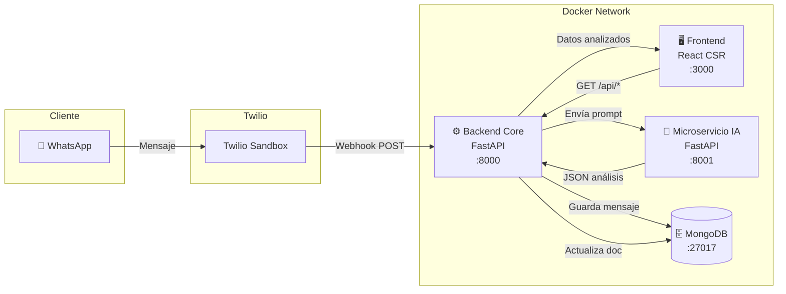
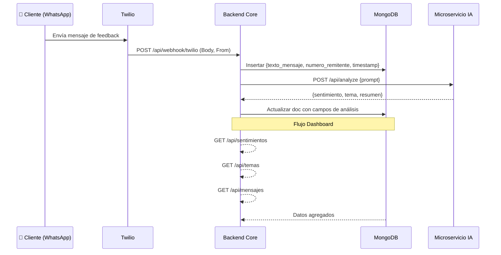

# 📋 Plan de Proyecto — Dashboard de Sentimiento del Cliente vía WhatsApp

## Visión General

Sistema end-to-end que permite a negocios recibir feedback de clientes vía WhatsApp, analizar automáticamente el sentimiento con IA, y visualizar los resultados en un dashboard interactivo en tiempo real.

---

## Arquitectura del Sistema



## Flujo de Datos Detallado



---

## User Review Required

> [!IMPORTANT]
> **Proveedor de IA**: El AGENTS.md indica "proveedor de IA compatible con la API de OpenAI". ¿Ya tienes un proveedor definido (OpenAI, Ollama local, OpenRouter, etc.)? Esto afecta la configuración del microservicio de IA y las variables de entorno necesarias.

> [!IMPORTANT]
> **Twilio Sandbox**: ¿Ya tienes una cuenta de Twilio con el Sandbox de WhatsApp configurado? Necesitaré el `TWILIO_ACCOUNT_SID`, `TWILIO_AUTH_TOKEN` y el número del sandbox como variables de entorno.

> [!WARNING]
> **Exposición del Webhook**: Para que Twilio alcance tu webhook local, necesitarás un túnel (ngrok o similar) o un despliegue público. ¿Cómo planeas manejar esto durante desarrollo?

---

## Open Questions

1. **¿Qué proveedor de LLM usaremos?** (OpenAI directo, Azure OpenAI, Ollama local, otro compatible con API de OpenAI). Esto define las env vars del microservicio IA.
2. **¿Tienes preferencia de librería de gráficos para React?** (Chart.js, Recharts, Victory, D3). Recomiendo **Recharts** por su integración nativa con React.
3. **¿El "tiempo real" del feed de mensajes debe ser con WebSockets/SSE o polling periódico?** El REQUIREMENT menciona "tiempo real" — recomiendo **polling cada 5-10 segundos** para simplificar, con opción a WebSocket en el futuro.
4. **¿Necesitas autenticación en el dashboard?** El requirement no lo menciona. Recomiendo dejarlo sin auth para MVP.
5. **¿Puerto preferido para cada servicio?** Propongo: Frontend `:3000`, Backend `:8000`, IA `:8001`, MongoDB `:27017`.

---

## Épicas e Historias de Usuario

### 🏗️ Épica 1: Infraestructura y DevOps

> **Objetivo:** Establecer la base de contenedores Docker y la orquestación con docker-compose para todos los servicios del sistema.

> [!NOTE]
> Según lo acordado, **tú crearás el entorno Docker y la base de datos**. Yo me enfocaré en escribir el código fuente. Las historias de esta épica son la referencia de lo que el entorno necesita.

| ID | Historia de Usuario | Prioridad | Puntos |
|----|---------------------|-----------|--------|
| E1-H1 | Como **desarrollador**, quiero un `docker-compose.yml` que orqueste los 4 contenedores (Frontend, Backend, IA, MongoDB) para levantar todo el sistema con un solo comando. | 🔴 Alta | 5 |
| E1-H2 | Como **desarrollador**, quiero un `Dockerfile` multi-stage para el Frontend React que genere una imagen de producción ligera con nginx. | 🔴 Alta | 3 |
| E1-H3 | Como **desarrollador**, quiero Dockerfiles para el Backend Core y el Microservicio IA basados en `python:3.11-slim`. | 🔴 Alta | 3 |
| E1-H4 | Como **desarrollador**, quiero un archivo `.env.example` con todas las variables de entorno necesarias documentadas, sin valores reales. | 🟡 Media | 1 |
| E1-H5 | Como **desarrollador**, quiero que la red Docker interna permita comunicación entre servicios por nombre de contenedor (ej. `http://ai-service:8001`). | 🔴 Alta | 2 |

**Criterios de Aceptación Épica 1:**
- `docker-compose up --build` levanta los 4 servicios sin errores
- Cada servicio es accesible en su puerto asignado
- Las variables de entorno se inyectan correctamente desde `.env`
- Los contenedores se comunican entre sí por nombre de servicio

---

### ⚙️ Épica 2: Backend Core (FastAPI)

> **Objetivo:** Desarrollar el servidor backend principal con FastAPI, incluyendo el webhook de Twilio, la conexión a MongoDB, y los endpoints de API para el dashboard.

| ID | Historia de Usuario | Prioridad | Puntos |
|----|---------------------|-----------|--------|
| E2-H1 | Como **desarrollador**, quiero una estructura modular del proyecto FastAPI con separación de routers, servicios y repositorios. | 🔴 Alta | 3 |
| E2-H2 | Como **sistema**, quiero conectarme a MongoDB usando Motor (async driver) al iniciar la aplicación, y cerrar la conexión al apagar. | 🔴 Alta | 3 |
| E2-H3 | Como **Twilio**, quiero enviar un POST al endpoint `/api/webhook/twilio` con el cuerpo del mensaje (`Body`) y número del remitente (`From`) para que el sistema lo procese. | 🔴 Alta | 5 |
| E2-H4 | Como **sistema**, quiero guardar cada mensaje recibido en MongoDB con los campos `texto_mensaje`, `numero_remitente` y `timestamp`. | 🔴 Alta | 3 |
| E2-H5 | Como **sistema**, después de guardar un mensaje, quiero enviar el texto al Microservicio IA y actualizar el documento con `sentimiento`, `tema` y `resumen`. | 🔴 Alta | 5 |
| E2-H6 | Como **frontend**, quiero un endpoint `GET /api/sentimientos` que devuelva la distribución agregada de sentimientos (positivo, negativo, neutro) con sus conteos. | 🔴 Alta | 3 |
| E2-H7 | Como **frontend**, quiero un endpoint `GET /api/temas` que devuelva la frecuencia de cada tema mencionado por los clientes. | 🔴 Alta | 3 |
| E2-H8 | Como **frontend**, quiero un endpoint `GET /api/mensajes` que devuelva los mensajes más recientes con su análisis de IA, paginados. | 🔴 Alta | 3 |
| E2-H9 | Como **sistema**, quiero un manejador global de excepciones que capture errores y retorne respuestas HTTP semánticas (400, 404, 500). | 🟡 Media | 2 |
| E2-H10 | Como **sistema**, quiero que todos los modelos de entrada/salida estén validados con Pydantic y Type Hints. | 🟡 Media | 2 |

**Criterios de Aceptación Épica 2:**
- El webhook recibe correctamente los datos de Twilio (formato `application/x-www-form-urlencoded`)
- Los mensajes se persisten en MongoDB con todos los campos requeridos
- La comunicación con el microservicio IA es asíncrona (httpx async)
- Los endpoints de API devuelven datos correctos en formato JSON
- Errores de validación retornan 400, errores de servidor retornan 500

**Estructura de carpetas propuesta:**
```
backend/
├── app/
│   ├── __init__.py
│   ├── main.py                  # Entry point FastAPI
│   ├── config.py                # Settings con Pydantic BaseSettings
│   ├── database.py              # Conexión MongoDB (Motor)
│   ├── exceptions.py            # Excepciones custom + handler global
│   ├── routers/
│   │   ├── __init__.py
│   │   ├── webhook.py           # Router webhook Twilio
│   │   └── dashboard.py         # Router endpoints dashboard
│   ├── services/
│   │   ├── __init__.py
│   │   ├── mensaje_service.py   # Lógica de negocio mensajes
│   │   └── ia_service.py        # Cliente HTTP al microservicio IA
│   ├── repositories/
│   │   ├── __init__.py
│   │   └── mensaje_repository.py # CRUD MongoDB
│   └── models/
│       ├── __init__.py
│       └── schemas.py           # Modelos Pydantic
├── requirements.txt
└── Dockerfile
```

---

### 🤖 Épica 3: Microservicio de IA

> **Objetivo:** Crear un microservicio aislado y agnóstico que reciba un prompt, lo procese con un LLM compatible con la API de OpenAI, y retorne la respuesta en formato JSON.

| ID | Historia de Usuario | Prioridad | Puntos |
|----|---------------------|-----------|--------|
| E3-H1 | Como **desarrollador**, quiero una aplicación FastAPI mínima con un único endpoint `POST /api/analyze` que reciba un prompt y devuelva la respuesta del LLM. | 🔴 Alta | 3 |
| E3-H2 | Como **sistema**, quiero que el microservicio construya un prompt de sistema que instruya al LLM a devolver estrictamente un JSON con `sentimiento`, `tema` y `resumen`. | 🔴 Alta | 3 |
| E3-H3 | Como **sistema**, quiero que el microservicio se conecte a cualquier proveedor compatible con la API de OpenAI mediante variables de entorno (`AI_API_KEY`, `AI_BASE_URL`, `AI_MODEL`). | 🔴 Alta | 3 |
| E3-H4 | Como **sistema**, quiero validar que la respuesta del LLM sea un JSON válido con los campos requeridos antes de retornarlo. | 🟡 Media | 2 |
| E3-H5 | Como **sistema**, quiero manejar errores del LLM (timeouts, respuestas malformadas) con reintentos y respuestas de error claras. | 🟡 Media | 2 |

**Criterios de Aceptación Épica 3:**
- El endpoint acepta un prompt string y devuelve un JSON con los 3 campos
- El servicio es **agnóstico** del proveedor: funciona con cualquier API compatible con OpenAI
- Las credenciales nunca están hardcodeadas
- Respuestas malformadas del LLM se manejan gracefully con retry
- El servicio **NO contiene lógica de negocio** — solo proxy al LLM

**Estructura de carpetas propuesta:**
```
ai-service/
├── app/
│   ├── __init__.py
│   ├── main.py           # Entry point FastAPI
│   ├── config.py          # Settings (API key, base URL, modelo)
│   ├── services/
│   │   ├── __init__.py
│   │   └── llm_service.py # Cliente OpenAI + prompt engineering
│   └── models/
│       ├── __init__.py
│       └── schemas.py     # Request/Response Pydantic models
├── requirements.txt
└── Dockerfile
```

---

### 🖥️ Épica 4: Frontend Dashboard (React)

> **Objetivo:** Construir un dashboard interactivo y visualmente atractivo con React que consuma la API del backend y muestre los datos de sentimiento en tiempo real.

| ID | Historia de Usuario | Prioridad | Puntos |
|----|---------------------|-----------|--------|
| E4-H1 | Como **desarrollador**, quiero inicializar un proyecto React con Vite, configurado con las dependencias necesarias (axios/react-query, recharts, etc.). | 🔴 Alta | 2 |
| E4-H2 | Como **gerente**, quiero ver un **Gráfico de Pastel** que muestre la distribución porcentual de sentimientos (positivo, negativo, neutro) con colores distintivos. | 🔴 Alta | 5 |
| E4-H3 | Como **gerente**, quiero ver un **Gráfico de Barras** que muestre la frecuencia de cada tema (Servicio, Calidad, Precio, Limpieza, Otro). | 🔴 Alta | 5 |
| E4-H4 | Como **gerente**, quiero ver un **Feed de Mensajes Recientes** que muestre los últimos mensajes con su sentimiento y tema asignado, actualizándose automáticamente. | 🔴 Alta | 5 |
| E4-H5 | Como **gerente**, quiero que el dashboard tenga un diseño profesional y moderno con modo oscuro, tipografía premium y animaciones sutiles. | 🟡 Media | 5 |
| E4-H6 | Como **gerente**, quiero ver **KPIs en tarjetas** en la parte superior: total de mensajes, porcentaje positivo, porcentaje negativo, tema más frecuente. | 🟡 Media | 3 |
| E4-H7 | Como **desarrollador**, quiero que el data fetching use React Query con estados de loading, error y refetch automático cada 10 segundos. | 🔴 Alta | 3 |
| E4-H8 | Como **gerente**, quiero que el dashboard sea responsive y se vea bien en pantallas de escritorio y tablet. | 🟡 Media | 3 |

**Criterios de Aceptación Épica 4:**
- Los gráficos renderizan datos reales de la API del backend
- El feed se actualiza automáticamente sin recargar la página
- El diseño es moderno, profesional y utiliza una paleta de colores consistente
- Los estados de carga (skeleton/spinner) se muestran mientras llegan los datos
- La lógica de estado (hooks/queries) está separada de los componentes de UI

**Estructura de carpetas propuesta:**
```
frontend/
├── src/
│   ├── main.jsx
│   ├── App.jsx
│   ├── index.css              # Design system global
│   ├── api/
│   │   └── dashboardApi.js    # Funciones de fetching con axios
│   ├── hooks/
│   │   └── useDashboard.js    # Custom hooks con React Query
│   ├── components/
│   │   ├── Layout/
│   │   │   ├── Header.jsx
│   │   │   └── Sidebar.jsx
│   │   ├── Charts/
│   │   │   ├── SentimentPieChart.jsx
│   │   │   └── TopicBarChart.jsx
│   │   ├── Feed/
│   │   │   └── MessageFeed.jsx
│   │   └── KPIs/
│   │       └── KPICards.jsx
│   └── pages/
│       └── Dashboard.jsx
├── package.json
├── vite.config.js
└── Dockerfile
```

---

### 🔗 Épica 5: Integración End-to-End

> **Objetivo:** Conectar todos los servicios, probar el flujo completo desde WhatsApp hasta el dashboard, y resolver problemas de integración.

| ID | Historia de Usuario | Prioridad | Puntos |
|----|---------------------|-----------|--------|
| E5-H1 | Como **desarrollador**, quiero configurar CORS en el backend para permitir peticiones desde el frontend. | 🔴 Alta | 1 |
| E5-H2 | Como **desarrollador**, quiero probar el flujo completo: enviar un mensaje por WhatsApp → verlo analizado en el dashboard. | 🔴 Alta | 3 |
| E5-H3 | Como **desarrollador**, quiero un endpoint de health check en cada servicio (`GET /health`) para verificar que están activos. | 🟡 Media | 1 |
| E5-H4 | Como **desarrollador**, quiero poder enviar mensajes de prueba directamente al webhook (sin Twilio) para testing local. | 🟡 Media | 2 |

**Criterios de Aceptación Épica 5:**
- El flujo WhatsApp → Twilio → Backend → IA → MongoDB → Dashboard funciona end-to-end
- El frontend puede comunicarse con el backend sin errores de CORS
- Existe un script o endpoint para testing sin dependencia de Twilio

---

### 📄 Épica 6: Documentación y Entrega

> **Objetivo:** Preparar la documentación del proyecto y los archivos necesarios para la entrega.

| ID | Historia de Usuario | Prioridad | Puntos |
|----|---------------------|-----------|--------|
| E6-H1 | Como **evaluador**, quiero un `README.md` completo que explique cómo configurar y ejecutar el proyecto localmente. | 🔴 Alta | 3 |
| E6-H2 | Como **evaluador**, quiero que el README incluya las decisiones técnicas tomadas y el enfoque de prompt engineering. | 🔴 Alta | 2 |
| E6-H3 | Como **desarrollador**, quiero un `.env.example` documentado con todas las variables necesarias. | 🟡 Media | 1 |

---

## Plan de Sprints

### Sprint 1 — Fundación (Épicas 1, 2, 3)
**Duración estimada:** Foco en backend  
**Meta:** Backend funcional que recibe webhooks, guarda en MongoDB y analiza con IA.

| Orden | Historias | Descripción |
|-------|-----------|-------------|
| 1 | E1-H4 | Crear `.env.example` con variables documentadas |
| 2 | E2-H1 | Estructura modular del proyecto backend |
| 3 | E2-H10 | Modelos Pydantic (schemas) |
| 4 | E2-H2 | Conexión a MongoDB con Motor |
| 5 | E2-H9 | Handler global de excepciones |
| 6 | E2-H4 | Repositorio: guardar mensajes en MongoDB |
| 7 | E3-H1, E3-H2, E3-H3 | Microservicio IA completo |
| 8 | E3-H4, E3-H5 | Validación y manejo de errores del LLM |
| 9 | E2-H5 | Servicio: integración Backend ↔ IA |
| 10 | E2-H3 | Webhook Twilio completo |
| 11 | E2-H6, E2-H7, E2-H8 | Endpoints API del dashboard |

### Sprint 2 — Dashboard (Épica 4)
**Duración estimada:** Foco en frontend  
**Meta:** Dashboard visual completo que consume la API del backend.

| Orden | Historias | Descripción |
|-------|-----------|-------------|
| 1 | E4-H1 | Inicializar proyecto React + Vite |
| 2 | E4-H7 | Configurar React Query + axios |
| 3 | E4-H5 | Design system: CSS global, tipografía, colores |
| 4 | E4-H6 | KPI Cards |
| 5 | E4-H2 | Gráfico de Pastel de Sentimientos |
| 6 | E4-H3 | Gráfico de Barras de Temas |
| 7 | E4-H4 | Feed de Mensajes Recientes |
| 8 | E4-H8 | Responsive design |

### Sprint 3 — Integración y Entrega (Épicas 5, 6)
**Duración estimada:** Foco en integración  
**Meta:** Sistema end-to-end funcionando, documentado y listo para entrega.

| Orden | Historias | Descripción |
|-------|-----------|-------------|
| 1 | E5-H1 | Configurar CORS |
| 2 | E5-H3 | Health checks |
| 3 | E5-H4 | Endpoint/script de testing local |
| 4 | E5-H2 | Prueba end-to-end completa |
| 5 | E6-H1, E6-H2, E6-H3 | Documentación final |

---

## Resumen de Puntos por Épica

| Épica | Nombre | Historias | Puntos |
|-------|--------|-----------|--------|
| E1 | Infraestructura y DevOps | 5 | 14 |
| E2 | Backend Core | 10 | 32 |
| E3 | Microservicio IA | 5 | 13 |
| E4 | Frontend Dashboard | 8 | 31 |
| E5 | Integración E2E | 4 | 7 |
| E6 | Documentación | 3 | 6 |
| **Total** | | **35** | **103** |

---

## Verification Plan

### Automated Tests
- `curl` al webhook simulando un POST de Twilio para verificar que el mensaje se guarda
- `curl` a los endpoints `/api/sentimientos`, `/api/temas`, `/api/mensajes` para validar formato JSON
- `curl` al microservicio IA con un prompt de prueba
- Verificar que `docker-compose up --build` levanta todos los servicios

### Manual Verification
- Enviar un mensaje real desde WhatsApp al sandbox de Twilio
- Verificar en MongoDB que el documento se creó y se actualizó con los campos de IA
- Abrir el dashboard en el navegador y confirmar que los gráficos renderizan datos reales
- Probar responsive en diferentes tamaños de pantalla

---

## Notas para el Entorno

> [!NOTE]
> **Lo que yo necesito que tú prepares:**
> 1. `docker-compose.yml` con los 4 servicios configurados
> 2. Dockerfiles para cada servicio (o los creo yo como parte del código)
> 3. Contenedor MongoDB accesible desde el backend
> 4. Red Docker interna para comunicación entre servicios
> 5. Archivo `.env` con las credenciales reales (Twilio, API de IA, MongoDB URI)
>
> **Lo que yo haré:**
> - Todo el código fuente: Backend, Microservicio IA, Frontend
> - Configuración de la app (no de infraestructura Docker)
> - Documentación técnica (README.md)
